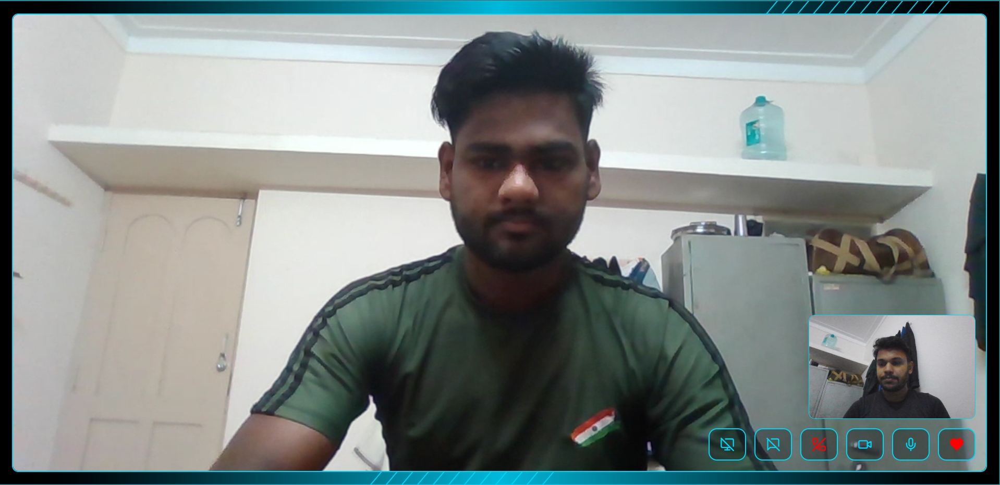

# ziggle_meet

A real-time video conferencing and screen sharing application built with **WebRTC**, **React**, and **WebSockets**.  
This project enables two users to connect seamlessly, share video/audio, exchange chat messages, and even share their screens — all in a minimal, modern interface.

---

## 🚀 Features

- 🔗 **1-on-1 Video Calling** – Real-time audio and video using WebRTC  
- 💬 **In-Call Chat** – Send instant messages during a call  
- 🖥 **Screen Sharing** – Share your screen in one click  
- 📱 **Responsive UI** – Works across desktop and mobile devices  
- ⚡ **Low Latency** – Smooth, near real-time experience powered by WebRTC and WebSockets  
- 🔒 **Secure** – Peer-to-peer encrypted communication

---

## 📸 Screenshots  

| Home | Dial Screen | Active Call | Chat | Screen Sharing |
|------|-------------|-------------|------|----------------|
|  |  |  |  |  |

---

## 🛠 Tech Stack

- **Frontend:** React, Tailwind, Css, JavaScript(ES6+)
- **Signaling Server:** Node.js, Express.js, Socket.Io
- **Real-Time Communication:** WebRTC, Socket.Io
- **Styling:** Custom CSS / Tailwind (if used)

