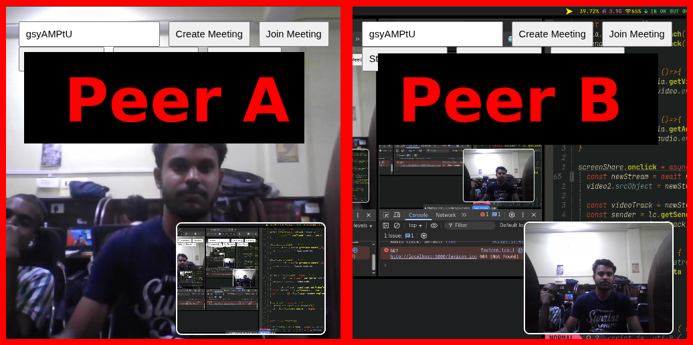

# OneoOne 📹

A lightweight 1-on-1 video calling app using **WebRTC** and **Socket.IO** for real-time communication. Inspired by platforms like Google Meet, but minimal and custom-built!

---

## 🚀 Features

- Peer-to-peer meeting.
- Built using WebRTC APIs.
- Simple signaling via Socket.IO
- Works directly in modern browsers (Chrome, Firefox).

---

## 📦 Tech Stack

- **Frontend**: HTML, CSS, JavaScript
- **Backend**: Node.js, Express, Socket.IO
- **WebRTC**: For establishing real-time video/audio peer connections

---
